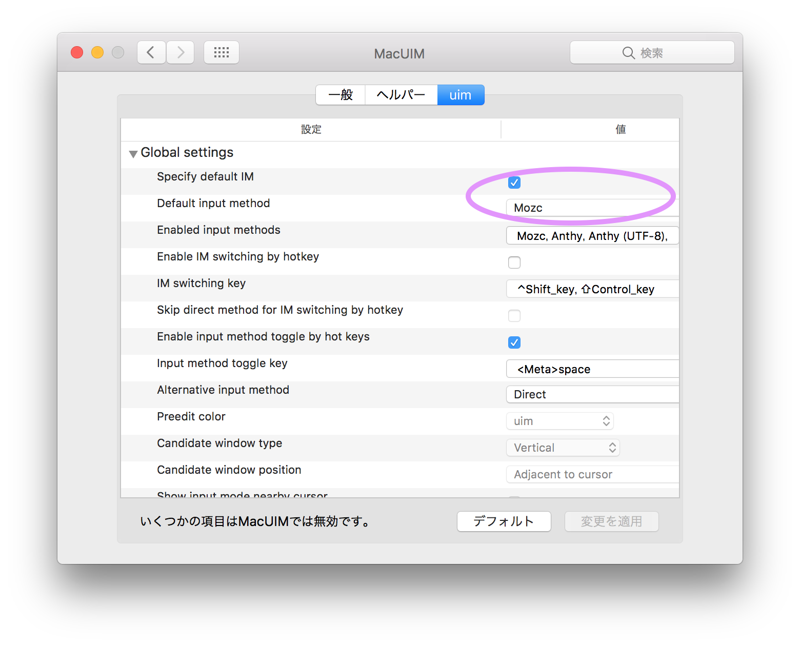
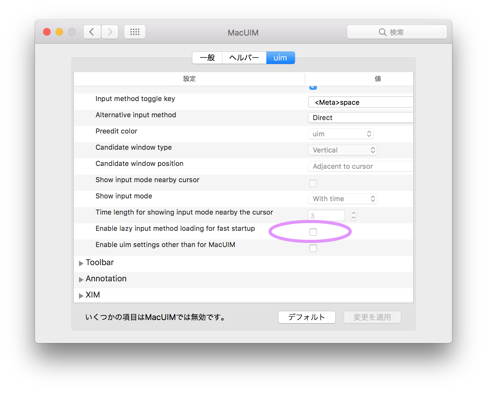

# MikutterInstallBattle
macOS Sierra での mikutter のインストール手順。  
前提条件として以下のものが必要であるため、事前にインストールして再起動しておくこと。
* [homebrew](https://brew.sh/index_ja.html)
* [XQuartz](https://www.xquartz.org/)


## 目次
<!-- TOC -->

- [MikutterInstallBattle](#mikutterinstallbattle)
    - [目次](#目次)
    - [インストール環境](#インストール環境)
    - [mikutter のダウンロー<br>ド](#mikutter-のダウンローbrド)
    - [ruby の用意](#ruby-の用意)
    - [mikutter の依存ライブラリのインストール](#mikutter-の依存ライブラリのインストール)
    - [日本語入力](#日本語入力)
    - [Special Thanks](#special-thanks)

<!-- /TOC -->

## インストール環境  
あくまで参考です。

| name     | version |
|----------|---------|
| macOS    | 10.12.5 |
| Homebrew | 1.2.1   |
| XQuartz  | 2.7.11  |

## mikutter のダウンロー<br>ド  
1. mikutterユーザーのほとんどは `git` の `develop` を使っているんだ。（当社比）
    ```
    $ brew install git
    ```
1. mikutter をインストールしたいディレクトリにいき、以下のコマンドでダウンロードする。
    ```
    $ git clone git://toshia.dip.jp/mikutter.git
    $ git checkout develop
    ```

## ruby の用意  
1. macOS にはデフォルトで `ruby` が入っていますが、ここでは任意のバージョンにするために　`rbenv` をインストールする。
    ```shell
    $ brew install rbenv
    ```
1. `rbenv` をインストールしたら、使っているシェルの `rc` ファイルに以下を追記する。( `.bashrc`, `.zshrc` など )
    ```
    export PATH=$HOME/.rbenv/bin:$PATH
    eval "$(rbenv init - zsh)"
    ```
1. `rbenv` を使って `ruby` をインストールします。  
    のちのち pry とか使いたい時に日本語が化けたりするので回避のため以下のコマンドを実行する。
    ```shell
    $ brew install readline
    $ brew link readline --force
    $ RUBY_CONFIGURE_OPTS="--with-readline-dir=$(brew --prefix readline)"
    ```
    ruby のインストール
    ```shell
    $ rbenv install 2.4.1
    $ cd [mikutterのダウンロードディレクトリ]
    $ rbenv local 2.4.1
    ```

## mikutter の依存ライブラリのインストール  
以下、全て mikutter のダウンロードディレクトリにいる前提で進める。  
`$ cd /path/to/mikutter`
1. Xcode のコマンドラインツールをインストール  
    そういえば、homebrew のインストール時に入れてたというやつ。
    すでに入ってる人は次の手順に進む。  
    これがないと `nokogiri` やらのインストールに失敗する。（ thx [@rettar5](https://twitter.com/rettar5/status/871323979079835648) ）
    ```
    $ xcode-select --install
    ```
1. bundler をインストール
    ```shell
    $ gem install bundler
    ```
1. `XQuartz` 向けに `Homebrew` のパッケージを少しいじる。
    ```shell
    $ brew edit gtk+
    ```
    エディタが起動するので次のパラメータの行をコメントアウトする。
    ```
    "--with-gdktarget=quartz"
    ```
1. `cairo` のインストール
    ```shell
    $ brew install cairo --with-x11
    ```
1. `pango` のインストール
    ```
    $ brew install pango
    ```
1. `gtk+` のインストール
    ```
    $ brew install gtk+ --build-from-source
    ```
1. 依存 `gem` のインストール
    ```
    $ bundle install
    ```

## 日本語入力
1. MacUIM のインストール

    以下の GitHub のページから MacUIM をインストールする。
    * [MacUIM](https://github.com/e-kato/macuim/releases)

    インストーラがある Latest を使う。  
    インストールしようとするとセキュリティがうんちゃらと出るのでノリと雰囲気で乗り切る。（設定のセキュリティを見るのです）  
    なお、インストールし次第ログアウトを迫られるので、ログアウトしても問題ないようにしておくと吉。

1. 起動設定の追加

    MacUIM の起動設定を書いたりする。  
    * `/Library/LaunchAgents/` に [mikutter_env.plist](./config/mikutter_env.plist) を設置する。  
    パスの関係上 `sudo` で設置する必要がある。
    * 以下のコマンドを実行してロードに必要なスクリプトを作る。
        ```
        $ mkdir -p ~/.xinitrc.d
        $ touch ~/.xinitrc.d/uim-xim.sh
        ```
    * 上で作った `uim-xim.sh` に以下を記述して保存する。
        ```shell
        #!/bin/sh
        /Library/Frameworks/UIM.framework/Versions/Current/bin/uim-xim &
        ```
    * シェルの `rc` ファイルに以下の3行を追加します。
        ```
        export LANG=ja_JP.UTF-8
        export XMODIFIERS=@im=uim
        export GTK_IM_MODULE=uim
        ```
    * MacUIM の設定
        1. macOS のシステム環境設定を開き、MacUIM の設定を開く（ちょっと時間がかかる）
        1. 一般タブの入力方式を `mozc(ja)` にする
        1. uimタブの全体設定をする
            * 標準入力方式を設定する

                全体設定の `標準の入力方式を指定` にチェックし、`標準の入力方式` を `mozc` にする。
                
            * 遅延ローディングの無効化

                `高速起動のための遅延ローディングを有効にする` のチェックを外す。
                

        1. macOS を再起動して終わり

            .　　　　　∞  
        　　　　　∫  
        　　,';:☜;.`,ਊ,,;';,;☞,.՞  
        　　՞  
        　　　　　　　　　お わ り

## Special Thanks
* 参考にした
    - [Mavericksで動いてたmikutterをYosemiteでも動くようにする方法](http://moguno.hatenablog.jp/entry/2014/11/23/095157) by moguno
    - [mikutter Advent Calendar 2013 Day2](http://akkiesoft.hatenablog.jp/entry/20131202/1385969580) by Akkiesoft
    - [@rettar5 のインストールバトル実況](https://twitter.com/rettar5/status/871323979079835648) by rettar5

* 林檎社

    意味不明な挙動を連発することで私に OS のクリーンインストールを促し、本ドキュメントの作成に最適な環境にすることを強いてくれたことに多大な感謝をいたします。
